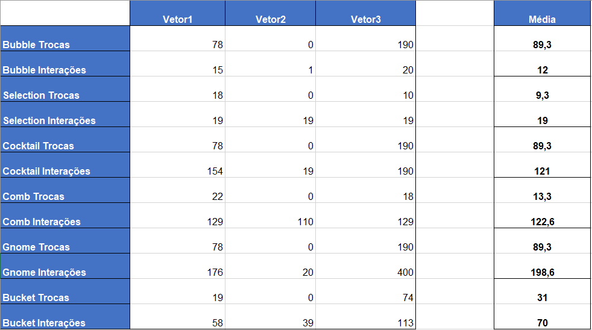

# Algoritmos-ordenacao⚙
Materia de aula de estruturacao de dados

🗣Feito por: Pedro Antonio Fernandes dos Santos Nazário

## Tipos de Algoritmos🧩

**VISTOS EM AULA**

### Bubble Sort 🧼
- DESCRIÇÃO: É um dos algoritmos mais simples. Ele percorre o vetor várias vezes, comparando pares de elementos adjacentes e trocando-os se estiverem fora de ordem.
             O maior valor “borbulha” para o final a cada passada.
### Selection Sort 🔎
- DESCRIÇÃO: Divide o vetor em duas partes: a ordenada e a desordenada. A cada passo, encontra o menor elemento da parte desordenada e o coloca na posição correta da parte ordenada.
### Cocktail Sort 🍹
- DESCRIÇÃO: É uma variação do Bubble Sort. Em vez de percorrer o vetor só em um sentido, ele percorre nos dois sentidos — primeiro da esquerda para a direita, depois da direita para a esquerda.
             Isso acelera a ordenação em alguns casos.

--------------------------------------

**VISTOS PARA O TDE**

### Comb Sort 🐝
- DESCRIÇÃO: Também baseado no Bubble Sort, mas com uma diferença: ele compara elementos separados por um intervalo (gap) que vai diminuindo a cada iteração.
             Isso ajuda a eliminar “tartarugas” (valores pequenos presos no final).
### Bucket Sort 🗑
- DESCRIÇÃO: Divide os elementos em baldes (buckets), com base em intervalos de valores.
             Cada balde é ordenado individualmente (geralmente com outro algoritmo simples), e depois todos os baldes são concatenados.
             Funciona bem para dados uniformemente distribuídos.
### Gnome Sort 👨‍🌾
- DESCRIÇÃO: Funciona como um “gnomo organizando vasos”: compara o elemento atual com o anterior e troca se estiver fora de ordem; se não precisar trocar, avança um passo.
             É semelhante com o bubble sort, porém bem simples e pequeno.

## Análise dos Algoritmos de Ordenação📊
- Foi feito 3 testes distintos com os 6 algoritmos de ordenacao, a fim de ver a eficiência de cada algoritmo.
- Para cada teste foi usado 1 vetor diferente:
  - **vetor1** -> 20 Valores entre 9 a 31
  - **vetor2** -> 20 Valores, já ordenados
  - **vetor3** -> 20 Valores, ordenado em ordem decrescente (e os algoritmos ordenam de forma crescente)

    
- As variáveis que utilizamos para comparar a eficiência de cada Algoritmo foram:
  - **Trocas**: o número de trocas que os algoritmos realizaram
  - **Interações**: o número de vezes que o Algoritmo "rodou" (fazendo seus loops no vetor)
  - (Obs: Considerei de utilizar tempo como métrica de comparação, mas todos os algoritmos funcionaram de forma consistente e rápida nos 3 testes, portanto conclui que em fator de tempo, dentro dos 3 testes, todas se saíram igualmente bem).

- O Resultado está no arquivo .txt e na tabela excel, ambas no repositório, a tabela foi feita para facilitar a visualização dos resultados gerados.
- Para facilitar ainda mais, resolvi implementar a tabela dos resultados aqui nesse ReadMe! a Imagem da Tabela está logo abaixo.

  

- Lendo o arquivot txt e a tabela excel, podemos tirar as seguintes conclusões:
  - Em todos os 3 casos, quem se saiu bem foi o Selection Sort. Pois esse algoritmo foi o que teve menos números de interações e trocas, mantendo se consistente.
  - O menos eficiente dentre eles foi o Gnome Sort, apesar de que, o gnome sort, até onde compreendi ele foi feito para ser um tipo de Algoritmo "Pocket", ou seja, um Algoritmo de simples implementação feito para lidar com situações e problemas simples. E, dando uma colher de chá, o Algoritmo dele é bem pequeno, e mesmo assim conseguiu ordenar e passar pelos 3 testes sem demorar 1 segundo.
  - É possível de perceber, em quesito de realizar a ordenação de valores, alguns algoritmos realizaram o mesmo número de trocas, porém é possível perceber o esforço de cada algoritmo para chegar á aquele valor por meio do número de interações que cada um teve.
  - No teste 2, aonde os Algoritmos receberam um vetor já Ordenado, quem se sobresaiu foi o Bubble Sort, com apenas 1 interação e 0 trocas, graças a implementação de detectar se o vetor está ordenado ou não (que implementamos na Aula de 17/10/2025).

  
